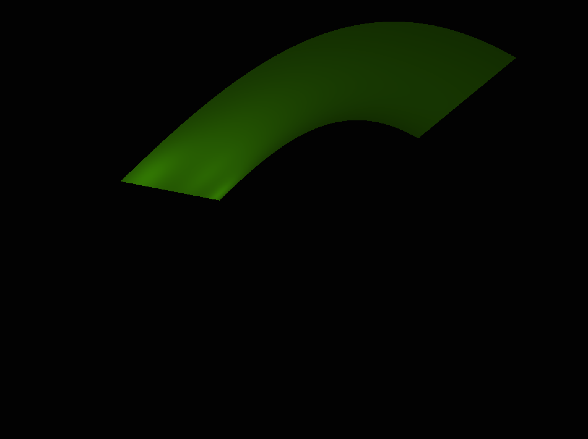
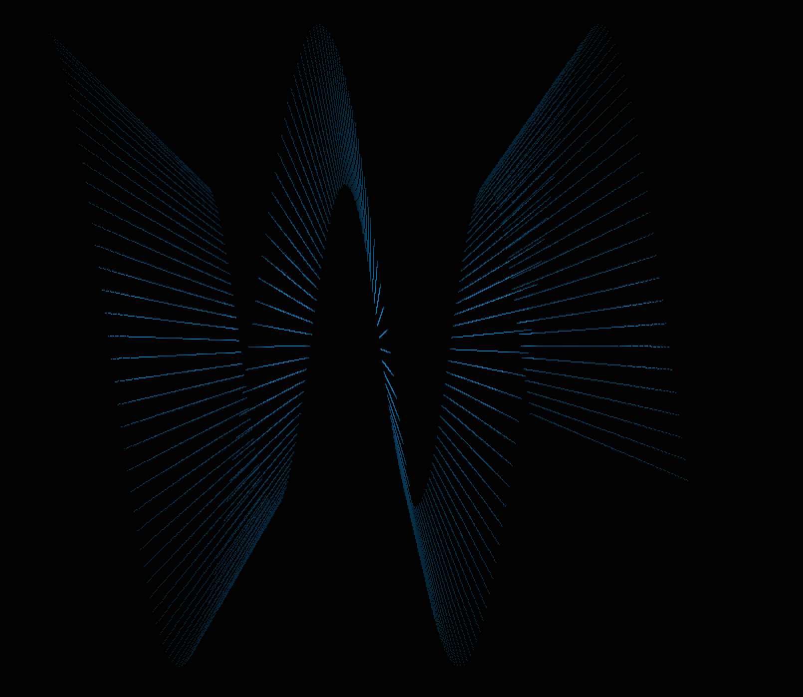
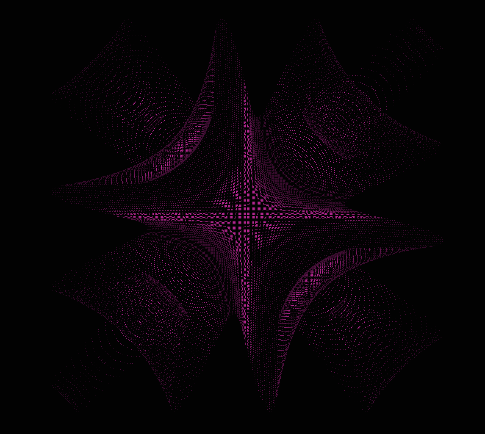

## Notes
  * Written by David Cardona for Michael Shah's 3D Graphics course at Havard Extension School, Fall 2020.
  * This project is written in C++, OpenGL, and SDL.
  * A demostration/explanation can be found at: https://youtu.be/Cu3k_METjzA

## Compiling Instructions
  * Compile by going into the 'sine_visualizer' directory, and running build.py
    * Note that this project requires C++17 and uses the GNU compiler (g++). This can be changed in the build.py file.

## Keyboard Controls
  ### MISC
  Q and ESC   --> Quit

  ### CAMERA
  a   --> Top view
  s   --> Bottom view
  d   --> Left side view
  f   --> Right side view
  g   --> Front side view
  h   --> Rear side view

  r   --> Toggle sideways rotation

  Up arrow            --> Move forward
  Bottom arrow        --> Move backwards
  Left arrow          --> Move left
  Right arrow         --> Move right
  Right shift         --> Move up
  Right CTRL or ALT   --> Move down

  ### WAVE CONTROLS
  [   --> Decrease amplitude
  ]   --> Increase amplitude
  ;   --> Decrease the wave number
  '   --> Increase the wave number
  .   --> Decrease the wave period
  /   --> Increase the wave period

  ### PLANE MODES
  z   --> X coord dependent Y axis sine
  x   --> Multiplied X and Z coords dependent Y axis sine
  c   --> Flat plane (useful for light debugging)

  ### RENDER MODES
  p   --> Render points
  o   --> Render triangle strip

  w   --> Geometry wireframe
  e   --> Framebuffer wireframe

  ### POST-PROCESSING EFFECTS
  1   --> Standard (no framebuffer processing)
  2   --> Grayscale
  3   --> Blur
  4   --> Invert colors
  5   --> Sharpen edges
  6   --> Edge detection

## Additional Development Resources
  * Calculate normals: https://www.khronos.org/opengl/wiki/Calculating_a_Surface_Normal
  * Mike Molisani's final project for computing tangent space without textures: https://www.youtube.com/watch?v=V4UakVeat_4&feature=youtu.be